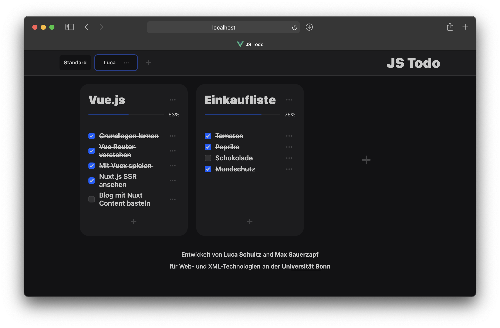

# Single Page Todo App

Diese SPA wurde als Projekt für das Modul *Web- und XML-Technologien* an der [Rheinische Friedrich-Wilhelms-Universität Bonn](https://www.uni-bonn.de/) entwickelt. Einige *Quirks* der Implementierung sind auf die sehr strengen und **klar definierten Anforderungen** der Aufgabenstellung zurückzuführen.

### Architektur des Clients

Ich habe versucht, den Client so modular wie möglich zu gestalten und eine *single source of truth* zu implementieren. Da [Vuex](https://vuex.vuejs.org) leider nicht erlaubt war, ist das *users array* in der *root instance* der *data store*. Das hat bei der ersten Abgabe leider dazu geführt, dass der Client recht kompliziert geworden ist.

Grundsätzlich gibt es drei Arten von Daten: Users, Listen und Items. Jede Art wird von einer Komponente dargestellt und mit einer anderen Komponente bearbeitet. Durch drücken des *edit buttons* auf einer *instance* wird das jeweilige Objekt in die Editor Komponente geladen. 

Durch das Abbrechen des Bearbeitens im Editor mit dem *cancel button* wird das Objekt im Editor gelöscht. So können bestehende Objekte bearbeitet und gelöscht werden. Ist kein Objekt im Editor, wird dieser als *add button* angezeigt. Dieser initialisiert ein neues Objekt das mit dem *confirm button* gespeichert werden kann.

### Architektur des Servers

Auch der Server sollte möglichst modular aufgebaut sein. Daher habe ich ein Datenbank Modul geschrieben. Dieses abstrahiert die Lese-/Schreibzugriffe auf die JSON-*Datenbank* mit `async` Funktionen. 

Die einzelnen Routen interagieren mit der API des Datenbank Moduls und antworten auf die *HTTP requests* des Clients. 

Die Fehlermeldungen, Objektvalidierung (der Anfragen), Response-Objekte und die Server Logs haben wir auch möglichst modular implementiert. Ich habe darauf geachtet, möglichst wenig Code zu wiederholen und jede Funktionalität in einem eigenen Modul zu implementieren.

### Zusammenführen von Client und Server

Im Endeffekt war die Architektur des Clients von Anfang an für das Server Backend ausgelegt. 

Ich habe habe für die zweite Abgabe nur ein Modul welches die API-Calls zum Backend abstrahiert und eine eine `error` Component (für Fehlermeldungen vom Server) hinzugefügt. 

Außerdem musste natürlich der Code der die Daten lokal verändert ersetzt werden und ein paar `emits` eingefügt werden um Fehlermeldungen/Erfolgmeldungen der Serverkommunikation zur *root instance* weiter zu leiten. Diese Meldungen werden genutzt um zu entscheiden ob die aktualisierten Daten vom Server geladen werden oder die Fehlermeldung angezeigt wird.

### Bekannte Bugs

Leider gibt es einige bekannte Bugs:

- Da der Server keine IDs sondern (gemäß der Aufgabenstellung) die  Titel der Objekte nutzt, können bestimmte Strings (z.B. leerer Listenname)zu Kommunikationsproblemen mit dem Server führen.
- Wenn man ein Objekt bearbeitet, kann es relativ einfach ausversehen gelöscht werden. Abbrechen des Bearbeitens im jeweiligen Editor löscht das Objekt. Könnte/Sollte man vermutlich durch andere Beschriftung der Buttons offensichtlicher machen
- Wenn kein *workload factor* vergeben wird, aktualisiert sich die %-Anzeige nicht. Wir waren uns uneinig wie man das am besten implementiert. Die zwei Ideen waren:
    + Ein nicht vergebener *workload factor* zählt als ein Faktor von 1
    + Ein nicht vergebener *workload factor* wird einfach nicht gezählt. Allerdings kann so eine Liste 100% angezeigt werden ohne dass alle Aufgaben erledigt sind.  

