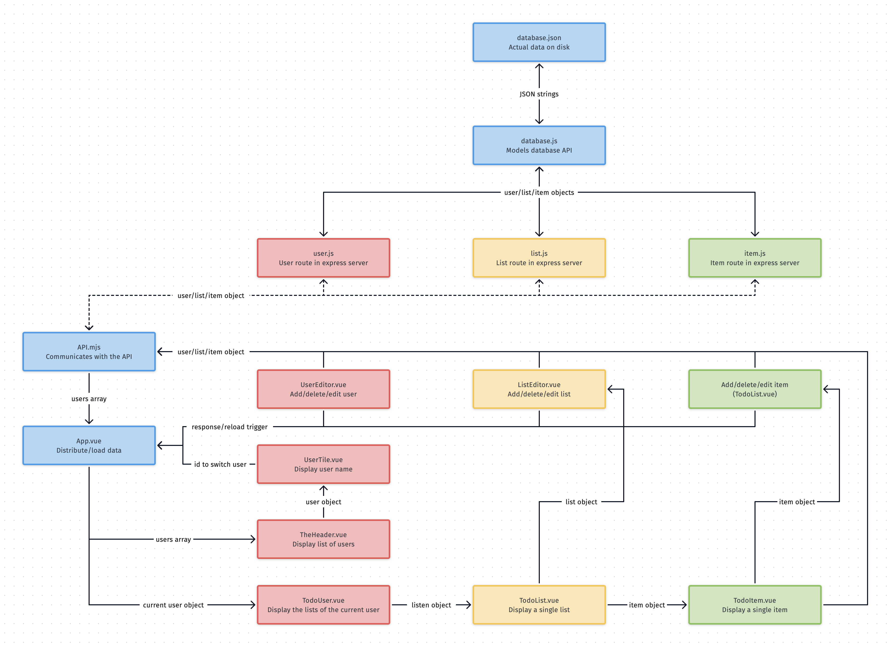

# JS Todo

### Architektur des Clients

Wir haben versucht den Client so modular wie möglich zu gestalten und möglichst eine *single source of truth* zu implementieren. Da das [Framework](https://vuex.vuejs.org) um einen *data store* in Vue.js zu implementieren leider nicht erlaubt war, ist das *users array* in der *root vue instance* der *data store*. Das hat bei der ersten Abgabe leider dazu geführt das der Client recht kompliziert geworden ist. Schließlich musste alles zunächst als *props* an die jeweils darstellenden *vue instance* gegeben, dort als eigene *data* enpackt (*props* sollen/dürfen nicht *mutated*), verarbeitet und wieder hoch zur *root instance emitted* werden. In der Endabgabe muss nichts mehr im Client verarbeitet werden, da der Server diese Aufgabe übernimmt.

Die Grundsätzliche Idee war folgende, es gibt drei grundsätzliche Arten von Daten: Users, Listen und Items. Jede werden von einer Komponente dargestellt und mit einer anderen Komponente bearbeitet. Durch drücken des *edit buttons* wird das jeweilige Objekt in die Editor Komponente geladen. 

Durch das Abbrechen des Bearbeitens im Editor mit dem *cancel button* wird das Objekt im Editor gelöscht. So können bestehende Objekte bearbeitet und gelöscht werden. Ist kein Objekt im Editor, wird dieser als *add button* angezeigt. Dieser initialisiert ein neues Objekt das mit dem *confirm button* gespeichert werden kann.

### Architektur des Servers

Auch der Server sollte möglichst modular aufgebaut sein. Daher haben wir ein zentrales Database Modul geschrieben. Dieses schreibt/liest die JSON Daten aus der *Datenbank* mit *async functions*. Die einzelnen Routen interagieren mit der API des Datenbank Moduls und antworten auf die *HTTP requests* des Clients. 

Die Fehlermeldungen, Objektvalidierung (der Anfragen), Responseobjekte und die Serverlogs haben wir auch möglichst Modular implementiert. Wir haben darauf geachtet möglichst wenig Code zu wiederholen und jede Funktionalität möglichst einfach in einem eigenen Modul zu implementieren. 

### Zusammenführen von Client und Server

Im Endeffekt war die Architektur des Clients von Anfang an für das Server Backend ausgelegt. Wir haben nur ein Modul hinzugefügt das die Server API spiegelt, eine *error component* hinzugefügt und den Code der die Daten lokal *mutated* ersetzt durch Code der das API Modul benutzt um Änderungen zum Server zu übertragen. Außerdem mussten noch ein paar *emits* eingefügt werden um Fehlermeldungen/Erfolgmeldungen der Serverkommunikation zur *root instance* weiter zu leiten. Diese Meldungen werden genutzt um ztu entscheiden ob die aktualisierten Daten vom Server geladen werden oder die Fehlermeldung angezeigt wird.

### Bekannte Bugs

Leider gibt es noch einige Bugs:

- Da der Server keine IDs sondern Namen nutzt, führt ein Leerer String als Name den ein User im Client vergibt für Kommunikationsprobleme mit dem Server.
- Wenn man ein Objekt bearbeitet, kann man es relativ einfach ausversehen löschen. Abbrechen des Bearbeitens im jeweiligen löscht das Objekt. Könnte man durch Beschriftung der Buttons offensichtlicher machen
- Wenn kein Workload Factor vergeben wird aktualisiert sich die %-Anzeige nicht.
- Einige ESLINT Warnungen ließen sich leide rnicht umgehen weil z.B. die Signatur von einer *error middleware* durch Express.js vorgegeben ist aber nicht alle übergebenen Argumente in der Funktion benötigt werden